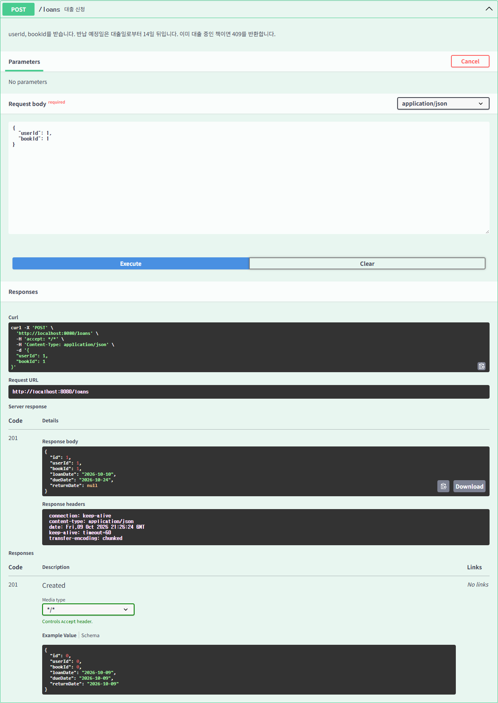
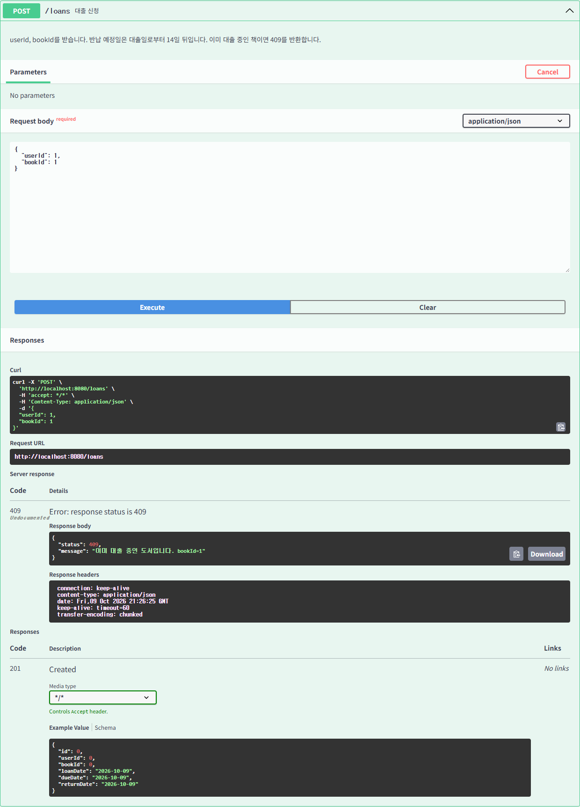
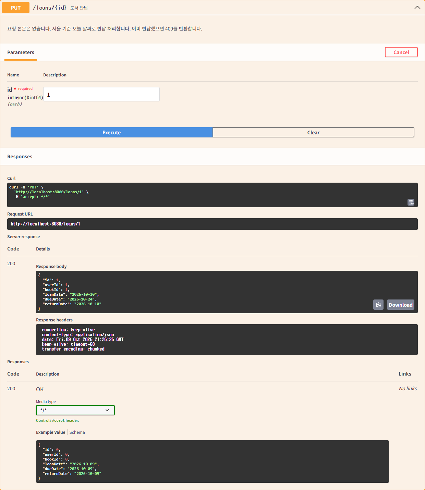
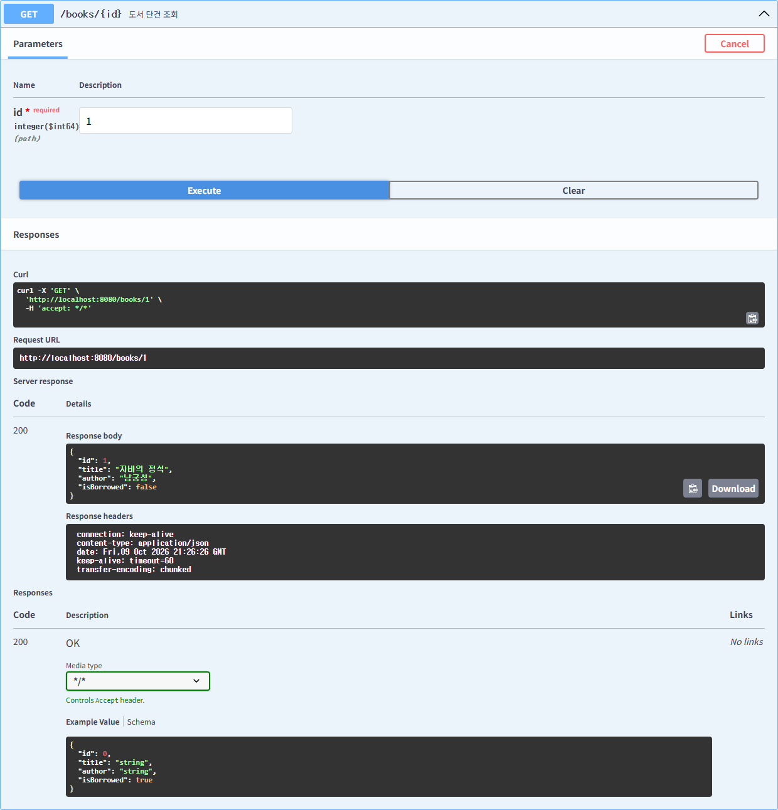
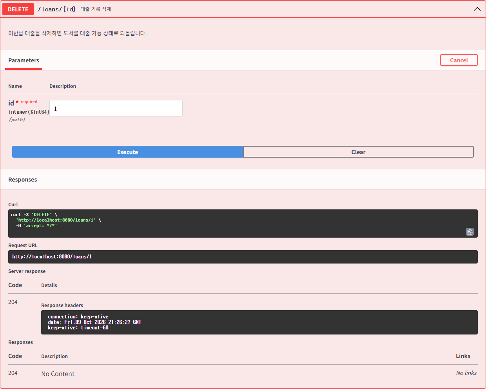

# Week 03 — 도서관 대출 API

Java 17 · Spring Boot 3.3.13 · Spring Data JPA · H2 · Gradle 8.14.5

제공된 지난주 ERD에 맞춰 아래 모델로 구현했습니다. DB 컬럼은 `snake_case`, JSON 필드는 `camelCase`입니다.

ERD 파일: [library-erd.dbml](docs/library-erd.dbml)

- `User`: id, email(100자, 필수·고유), password(255자, 필수), createdAt
- `Book`: id, title(255자, 필수), author(255자, 필수), isBorrowed(필수, 기본값 false)
- `Loan`: id, user, book, loanDate(필수), dueDate(필수), returnDate(미반납이면 null) — 회원과 도서를 각각 다대일 관계로 연결

`user`는 H2 예약어이므로 테이블 이름을 인용해 ERD의 이름을 유지했습니다. 가입 일시는 서버에서 서울 시간으로 저장하며, 비밀번호는 [Spring Security의 PasswordEncoder](https://docs.spring.io/spring-security/reference/features/authentication/password-storage.html)를 사용해 PBKDF2 해시로 저장합니다. 회원 응답에는 `id`, `email`, `createdAt`만 포함합니다.

## IntelliJ IDEA 실행

1. 이 폴더의 `build.gradle`을 Open → **Open as Project**로 엽니다.
2. Project SDK와 Settings → Build Tools → Gradle → Gradle JVM을 **Java 17**로 설정합니다. 이 PC의 설치 경로는 `D:\Java\temurin-17\jdk-17.0.20.1+1`입니다.
3. Gradle 동기화 후 `LibraryApplication.main()`을 실행합니다.
4. [Swagger UI](http://localhost:8080/swagger-ui/index.html)를 엽니다.

PowerShell에서는 Java 17을 `JAVA_HOME`에 설정하고 실행합니다.

```powershell
$env:JAVA_HOME = 'D:\Java\temurin-17\jdk-17.0.20.1+1'
.\gradlew.bat bootRun
```

H2 메모리 DB를 사용하므로 서버를 종료하면 데이터가 초기화됩니다. 별도 DB 설치는 필요 없습니다.

## API

| 대상 | 목록 조회 | 단건 조회 | 생성 | 삭제 | 반납 |
| --- | --- | --- | --- | --- | --- |
| 회원 | GET /users | GET /users/{id} | POST /users | DELETE /users/{id} | — |
| 도서 | GET /books | GET /books/{id} | POST /books | DELETE /books/{id} | — |
| 대출 | GET /loans | GET /loans/{id} | POST /loans | DELETE /loans/{id} | PUT /loans/{id} |

생성은 `201`, 조회/반납은 `200`, 삭제는 본문 없이 `204`를 반환합니다. 잘못된 입력은 `400`, 없는 ID는 `404`, 중복 이메일/대출/반납 또는 대출 기록이 있는 회원·도서 삭제는 `409`입니다.

## Swagger에서 따라 하기

각 API를 펼쳐 **Try it out → Execute**를 누릅니다. 생성 응답의 실제 ID를 다음 요청에 사용하세요.

1. `POST /users`: `{"email":"sua@example.com","password":"practice-password"}`
2. `POST /books`: `{"title":"자바의 정석","author":"남궁성"}`
3. `POST /loans`: `{"userId":1,"bookId":1}` → `201`, `dueDate`는 `loanDate`로부터 **14일 뒤**, `returnDate: null`
4. `GET /books/1` → `isBorrowed: true`
5. 같은 `POST /loans`를 다시 실행 → `409` (중복 대출 거절)
6. `GET /loans`, `GET /loans/1` → 대출 DTO 조회
7. `PUT /loans/1` → **요청 본문 없이** 반납; 서울 기준 오늘 날짜로 `returnDate` 저장
8. `GET /books/1` → `isBorrowed: false`
9. `DELETE /loans/1` → `204`; 이후 `GET /loans/1` → `404`

반납을 다시 요청하면 `409`입니다. 대출 삭제는 과제용 취소 기능도 겸합니다. 미반납 대출을 삭제하면 책을 대출 가능 상태로 복구하고, 반납된 옛 기록을 삭제할 때는 현재 대출 상태를 유지합니다. 회원/도서는 연결된 대출 기록을 먼저 삭제해야 삭제할 수 있습니다.

## 코드 흐름

`LoanCreateRequest → LoanController → LoanService → LoanRepository → LoanResponse`

- Request DTO는 클라이언트가 전달한 `userId`, `bookId`를 검증합니다.
- Service가 회원·도서를 조회하고 `Book.isBorrowed`를 검사합니다.
- 대출 생성과 `book.borrow()`는 하나의 쓰기 트랜잭션에서 실행합니다. 조회한 Book의 변경은 JPA 변경 감지로 반영됩니다.
- 대출 Entity 생성 시 `loanDate.plusDays(14)`로 `dueDate`를 계산합니다. 대출일·반납 예정일은 서버가 결정하며, 반납해도 예정일을 유지합니다.
- 같은 책의 생성·반납·삭제는 `PESSIMISTIC_WRITE` 락으로 직렬화하여 동시 대출도 막습니다.
- 반납은 클라이언트 입력이 필요한 필드가 없어 Request DTO 없이 경로 ID만 받습니다.
- Response DTO는 연결된 Entity 대신 ID와 날짜를 반환합니다. Controller는 Service만 호출합니다.

## 검증

```powershell
.\gradlew.bat test bootJar
```

`LibraryApiTest`는 실제 H2 DB로 전체 대출 흐름, DTO 응답, 상태 변경, 입력 검증, 없는 ID, 중복 반납, 관련 데이터 삭제 제한, 옛 대출 삭제, 동시 대출 경쟁 및 Swagger 명세를 검증합니다. ERD에 따른 이메일 UNIQUE 제약, 비밀번호 해시 저장/응답 제외, 가입 일시, 255자 도서 필드, DB 기본값과 `due_date` 필수 제약도 검증합니다. 테스트 날짜를 고정해 서울 기준 날짜와 월을 넘기는 14일 계산을 확인합니다.

2026-10-10 검증 결과: Java 17 `test bootJar` 성공, 테스트 **15개 통과**, Swagger UI에서 실제 API **22회 호출 검증**, 스크린샷 **12장 저장**. 상세 응답은 [results.json](docs/screenshots/results.json)에서 확인할 수 있습니다.

Swagger UI 자동 검증/스크린샷을 다시 생성하려면 서버 실행 후 Node.js와 Chrome이 설치된 환경에서 다음을 실행합니다. 실제 Swagger의 Try it out/Execute 버튼으로 테스트 데이터를 만들고 검증 후 해당 데이터를 삭제합니다.

```powershell
npm install --prefix .tools --no-audit --no-fund playwright
node scripts/swagger-smoke.cjs
```

## 제출

제출 브랜치는 `week-03/sua`입니다.

스크린샷과 호출 결과는 `docs/screenshots`에 저장합니다. 원격 push는 수행하지 않았습니다.

### 제출 스크린샷

대출 생성 — `201 Created`



중복 대출 거절 — `409 Conflict`



반납 처리 — `200 OK`, `returnDate` 저장



반납 후 도서 상태 — `isBorrowed: false`



대출 기록 삭제 — `204 No Content`



회원/도서 생성, 대출 목록/단건 조회, 삭제 후 404, 중복 이메일 409 화면도 같은 폴더에 첨부했습니다.

### 체크리스트

- [x] Controller 응답은 Entity 대신 Response DTO
- [x] Controller는 Repository 대신 Service 호출
- [x] URI는 복수형 명사 `/users`, `/books`, `/loans`
- [x] 생성 API는 `201 Created`
- [x] 대출 생성 시 `Book.isBorrowed`도 `true`로 갱신
- [x] 반납 시 `returnDate` 저장 및 `Book.isBorrowed`를 `false`로 갱신
- [x] `@Tag` / `@Operation` 설명 및 Swagger 실제 호출 스크린샷
- [x] 중복 대출 방지 및 동시 요청 검증
- [x] ERD 필드·길이·필수 조건·이메일 고유 제약 반영
- [x] 반납 예정일은 대출일로부터 14일 뒤
- [x] 비밀번호 해시 저장 및 응답 제외

Swagger `2.6.0`은 과제 예시를 유지했으며, [springdoc 공식 호환표](https://springdoc.org/v2/#what-is-the-compatibility-matrix-of-springdoc-openapi-with-spring-boot)에 맞춰 Spring Boot 3.3.x를 사용했습니다.
